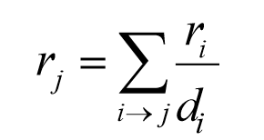
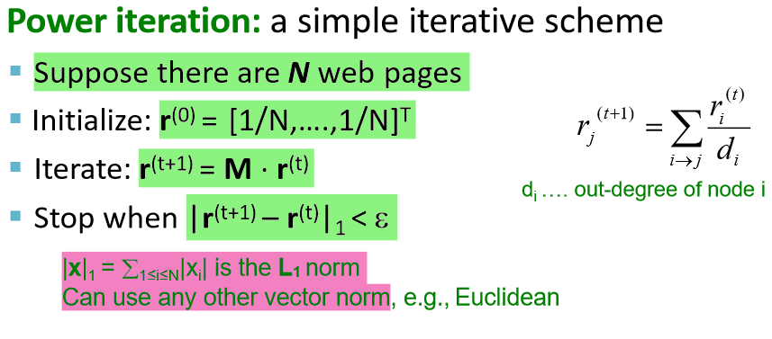

1)Illustrare in maniera sintetica i problemi dei recommender systems di tipo content-based.

  
		**many of the same /overspecialization** := rischio di raccomandazioni ripetitive con scarsa novelty/serendipity per via della sovraspecializzazione del recommender
		 
		**new user** := non conosco i gusti del nuovo utente quindi non so cosa raccomandargli
		 
		**limited content analisys** := un item potrebbe essere descritto in generale senza fare menzione delle feature più importanti, che potrebbe portare a raccomandare l'item quando non dovrebbe o proprio a non essere mai raccomandato
   
2)Illustrare in maniera sintetica i problemi dei recommender systems di tipo collaborativo.

  
		**matrice sparsa per i rating** := difficile trovare dei vicini
		se un utente non esprime preferenze non può avere raccomandazioni
		 
		**cold-start** := senza community non c'è modo di raccomandare (ma si possono usare altri approcci)
		 
		**new-user** := non può avere raccomandazioni
		 
		**new-item** := un nuovo item non ha preferenze di alcun utente e dunque non può essere raccomandato
		 
		**grey-sheep** := difficile trovare utenti simili significativi se un utente valuta in modo "intermedio" ogni item, non si sbilancia nel valutare.
		 
		**"canto delle sirene"(SEMERARO TRADEMARK)** := valutazioni false o organizzate alterano lo stato del sistema e influenzano le raccomandazioni
   
3)Descrivere le metriche di errore (MAE ed RMSE) utilizzate per la valutazione dell’accuratezza dei recommender systems.

  
	**MAE** := Mean Absolute Error, calcola la deviazione tra i rating predetti e i rating reali
 
	**RMSE** := Root Mean Square Error, come MAE ma penalizza deviazioni più grandi utilizzando il quadrato della differenza tra rating predetto e rating attuale

   
4)Descrivere, commentando opportunamente, la funzione per il calcolo delle predizioni dei rating in un algoritmo di filtraggio collaborativo di tipo user-to-user.

5)Illustrare in maniera sintetica il problema della overspecialization (sovraspecializzazione) dei content-based recommender systems

6)Illustrare in maniera sintetica il problema del Cold-start nei recommender systems di tipo collaborativo

   
7)Descrivere in maniera sintetica i principi alla base del PageRank, focalizzando l’attenzione sulla formulazione ricorsiva basata sul “flow” model.

  
	**INTRO**
	Il web viene visto come un grafo orientato dove i nodi rappresentano le pagine web e gli archi rappresentano i link tra le pagine.
	Per il rank delle pagine si sfrutta la struttura del grafo (link entranti e uscenti da ogni nodo)
	 
	**FLOW MODEL**
	I link vengono visti come voti, l'importanza di un link è proporzionale all' importanza della pagina da cui proviene. In particolare il peso di un link è dato dall' importanza della pagina diviso l'out degree della pagina.
	L'importanza di una pagina è data dalla somma dei voti su i suoi link entranti.
	 
	
	 
	se costruiamo le "equazioni di flusso" per un grafo otteniamo n equazioni in n incognite
	e questo non permette di avere una soluzione unica, per risolvere questo problema
	si aggiunge un ulteriore vincolo che permette l'unicità (r1+r2+...+rn=1)
	Questa formulazione funziona bene con piccoli grafi ma non è scalabile. 
	quini abbiamo bisogno di una nuova formulazione ovvero la **MATRIX FORMULATION**

   
8)Descrivere in maniera sintetica i concetti fondamentali alla base del modello dei dati RDF, in particolare i concetti di risorsa, proprietà e statement.

  
	il modello dei dati RDF è basato su tre concetti:
	 
	 – **Risorse**: tutto ciò che viene descritto, ogni risorsa è identificata da un URI
	 
	 – **Proprietà**: una coppia attributo-valore che si vuole associare ad una risorsa, l'attributo è anch'esso identificato da un URI e il valore può essere un'altra risorsa o un tipo di dato primitivo (stringa, intero...)
	 
	 – **Asserzioni o statement**: l’associazione di una proprietà ad una risorsa, ci dice che “una risorsa (soggetto) ha un certo valore (oggetto) per una certa proprietà (predicato)”

   
9)Descrivere il problema dello spider trap nell’algoritmo PageRank e illustrare una possibile soluzione.

  
	**spider trap**: se nel grafo ci sono dei cicli i nodi coinvolti nel ciclo assorbono l'importanza e non è garantita la convergenza dell' algoritmo 
	una possibile soluzione è data dal random teleport 
	**random teleport**: ad ogni istante si segue un link con probabilita b e si salta ad una pagina casuale con probabilita 1-b. 
	(b in range(0.8, 0.9)) 

10)Descrivere i principali problemi dell’algoritmo PageRank e illustrare una possibile soluzione.

  
	**spider trap**: se nel grafo ci sono dei cicli, i nodi coinvolti nel ciclo assorbono l'importanza e non è garantita la convergenza dell'algoritmo 
	**dead end**: se c'e un nodo senza archi uscenti l'algoritmo converge ma tutte le pagine avranno importanza 0. 
	entrambi i problemi si risolvono con il **random teleport**: ad ogni istante si segue un link con probabilita b e si salta ad una pagina casuale con probabilita 1-b (b in range[0.8, 0.9])

   
11)Descrivere in maniera sintetica il concetto di reificazione degli statement RDF.

  
	**reificazione** significa riduzione ad oggetto dell'asserzione. Si utilizza la reificazione per esprimere meta-informazioni su una meta-informazione. Quindi l'oggetto della tripla Soggetto-Proprietà-Oggetto diventa uno statement, quindi una tripla Soggetto-Proprietà-Oggetto.
	Dopo avere reificato l’asserzione si potranno esprimere ulteriori proprietà su di essa.

12)Descrivere in maniera sintetica i principi alla base del PageRank, focalizzando l’attenzione sulla formulazione basata su matrici di adiacenza stocastiche
 
	**INTRO**
	Il web viene visto come un grafo orientato dove i nodi rappresentano le pagine web e gli archi rappresentano i link tra le pagine.
	Per il rank delle pagine si sfrutta la struttura del grafo (link entranti e uscenti da ogni nodo)
	  
	**MATRIX FORMULATION**: 
	In questa formulazione si costruisce a partire dal grafo una matrice di adiacenza stocastica
	dove se la pagina I ha Di link uscenti allora
	se i->j allora Mji=1/Di altrimenti Mji=0. 
	Dato r un vettore con un valore per ogni pagina:
	ri è l' importanza della pagina i. 
	La somma dei valori di r=1 
	 
	quindi data M:matrice di adiacenza e r:vettore dei rank le "equazioni di flusso"
	possono essere scritte come ***r=M*r***. 
	Cosi facendo abbiamo trasformato il problema del ranking nel problema di ricerca di un autovettore per la matrice M. 
	L'autovettore che cerchiamo è quello associato all'autovalore 1 (il fatto che la matrice M sia stocastica ci assicura l'esistenza di tale autovettore). 
	Inoltre possiamo risolvere questo problema in modo efficiente con il metodo delle power iteration: 
	
