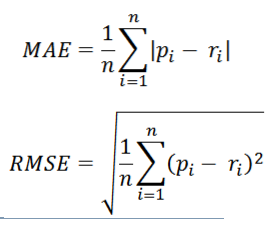

1)Illustrare in maniera sintetica i problemi dei recommender systems di tipo content-based.

  
		**many of the same /overspecialization** := rischio di raccomandazioni ripetitive con scarsa novelty/serendipity per via della sovraspecializzazione del recommender
		 
		**new user** := non conosco i gusti del nuovo utente quindi non so cosa raccomandargli
		 
		**limited content analisys** := un item potrebbe essere descritto in generale senza fare menzione delle feature più importanti, che potrebbe portare a raccomandare l'item quando non dovrebbe o proprio a non essere mai raccomandato
   
2)Illustrare in maniera sintetica i problemi dei recommender systems di tipo collaborativo.

  
		**matrice sparsa per i rating** := difficile trovare dei vicini
		se un utente non esprime preferenze non può avere raccomandazioni
		 
		**cold-start** := senza community non c'è modo di raccomandare (ma si possono usare altri approcci)
		 
		**new-user** := non può avere raccomandazioni
		 
		**new-item** := un nuovo item non ha preferenze di alcun utente e dunque non può essere raccomandato
		 
		**grey-sheep** := difficile trovare utenti simili significativi se un utente valuta in modo "intermedio" ogni item, non si sbilancia nel valutare.
		 
		**"canto delle sirene"(SEMERARO TRADEMARK)** := valutazioni false o organizzate alterano lo stato del sistema e influenzano le raccomandazioni
   
3)Descrivere le metriche di errore (MAE ed RMSE) utilizzate per la valutazione dell’accuratezza dei recommender systems.

  
	**MAE** := Mean Absolute Error, calcola la deviazione tra i rating predetti e i rating reali
 
	**RMSE** := Root Mean Square Error, come MAE ma penalizza deviazioni più grandi utilizzando il quadrato della differenza tra rating predetto e rating attuale

   
4)Descrivere, commentando opportunamente, la funzione per il calcolo delle predizioni dei rating in un algoritmo di filtraggio collaborativo di tipo user-to-user.

5)Illustrare in maniera sintetica il problema della overspecialization (sovraspecializzazione) dei content-based recommender systems

  
		in un content-based recommender system c'è alto rischio di **overspecialization**, perchè creando il profilo si tende a consigiare spesso "many of the same", cioè oggetti sempre molto simili tra loro avendo scarsa **novelty/serendipity**.

6)Illustrare in maniera sintetica il problema del Cold-start nei recommender systems di tipo collaborativo

7)Descrivere in maniera sintetica i principi alla base del PageRank, focalizzando l’attenzione sulla formulazione ricorsiva basata sul “flow” model.

8)Descrivere in maniera sintetica i concetti fondamentali alla base del modello dei dati RDF, in particolare i concetti di risorsa, proprietà e statement.

9)Descrivere il problema dello spider trap nell’algoritmo PageRank e illustrare una possibile soluzione.

10)Descrivere i principali problemi dell’algoritmo PageRank e illustrare una possibile soluzione.

11)Descrivere in maniera sintetica il concetto di reificazione degli statement RDF.

12)Descrivere in maniera sintetica i principi alla base del PageRank, focalizzando l’attenzione sulla formulazione basata su matrici di adiacenza stocastiche
